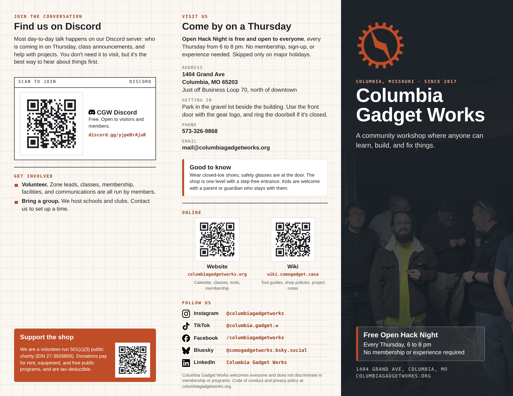
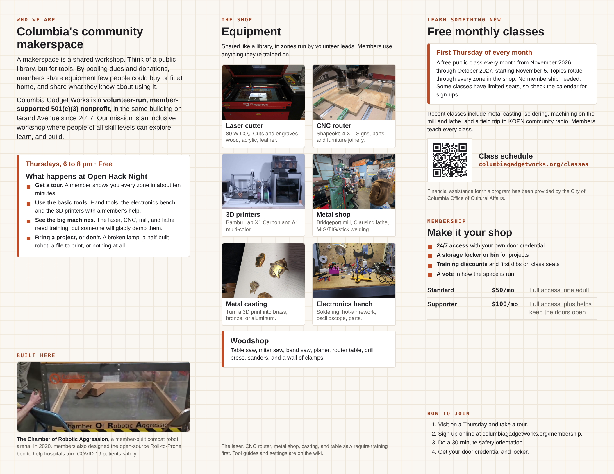
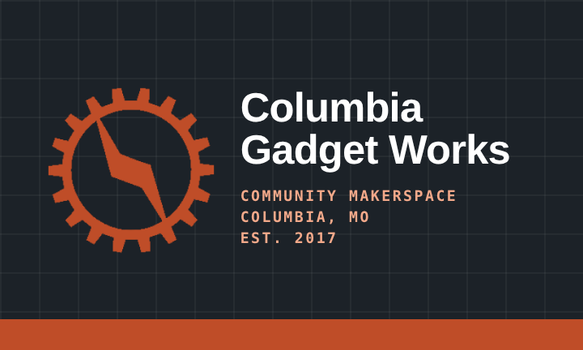
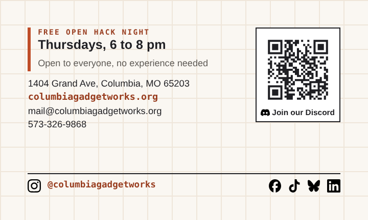

# Columbia Gadget Works print materials

A tri-fold pamphlet and a business card, in the same design language.

## Pamphlet

A printable tri-fold pamphlet for the library and for people taking a tour of
the shop. Ready to print: **[build/pamphlet.pdf](build/pamphlet.pdf)**.

| Outside | Inside |
|---|---|
|  |  |

What is in it, ideas for more, and the pre-print checklist:
[CONTENT.md](CONTENT.md).

### Printing the pamphlet

- US Letter, landscape, **double-sided, flip on short edge**.
- Print at **100% / actual size**, not "fit to page".
- Everything stays 0.3 in from the paper edge, so any office printer works; no bleed is needed.
- Fold as a standard letter fold (tri-fold): the cover is the right-hand panel
  of page 1, and the left-hand panel of page 1 folds in first.
- Print one test copy and scan each QR code before printing a stack.

## Business card

Standard US business card, 3.5 x 2 in, two-sided. Front: logo and name.
Back: Open Hack Night, address, website, email, phone, a Discord QR code,
and a row of social icons with the Instagram handle.

| Front | Back |
|---|---|
|  |  |

Two print files:

- **[build/business-card.pdf](build/business-card.pdf)**: for a print shop.
  Page 1 is the front, page 2 the back, each 3.75 x 2.25 in including a
  1/8 in bleed on every side (trim to 3.5 x 2 in).
- **[build/business-card-sheet.pdf](build/business-card-sheet.pdf)**: for
  printing in-house on US Letter perforated card sheets with 10 cards per
  sheet (Avery 8371 / 5371 layout). Print double-sided, flip on long edge,
  at 100%. The small tick marks show the cut lines; do a plain-paper test
  first and hold it against a card sheet to check alignment.

## Editing

The pamphlet is `pamphlet.html` and the card is `business-card.html`. Edit the text there and rebuild:

```bash
pip install segno      # QR codes
npm install            # playwright, for rendering to PDF
./build.sh
```

`build.sh` writes the QR codes to `build/qr/` (links are in
`scripts/make_qr.py`), then renders the PDFs and preview images in `build/` with headless
Chromium.

House style: no em dashes, short and plain.

## Design

Borrowed from the CGW website (rust `#BF4D28`, steel, warm paper, Arial,
uppercase eyebrow labels, cards with a rust left rule, the dark photo hero)
and the shop kiosk page (drafting grid background, mono labels, ink-bordered
title blocks).

## Images

All photos are real photos of the shop, copied from the website repository
(`ColumbiaGadgetWorks/website`, `assets/img/`). The gear logo is the
website's `static/img/cgw-gear.png`. Social media icons are the official brand marks from
[Simple Icons](https://simpleicons.org) (CC0), in `assets/icons/`. No AI-generated images or logos are used;
keep it that way when swapping photos.
